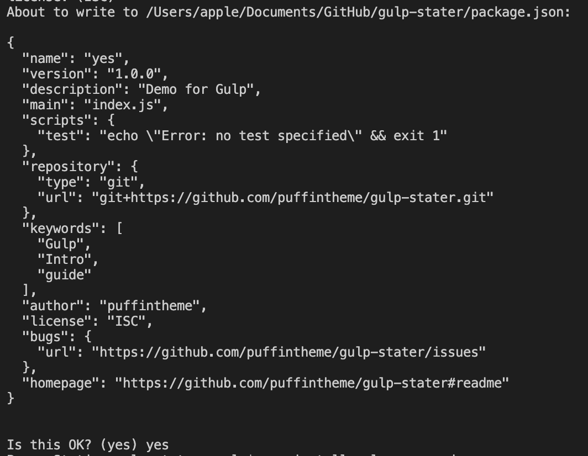
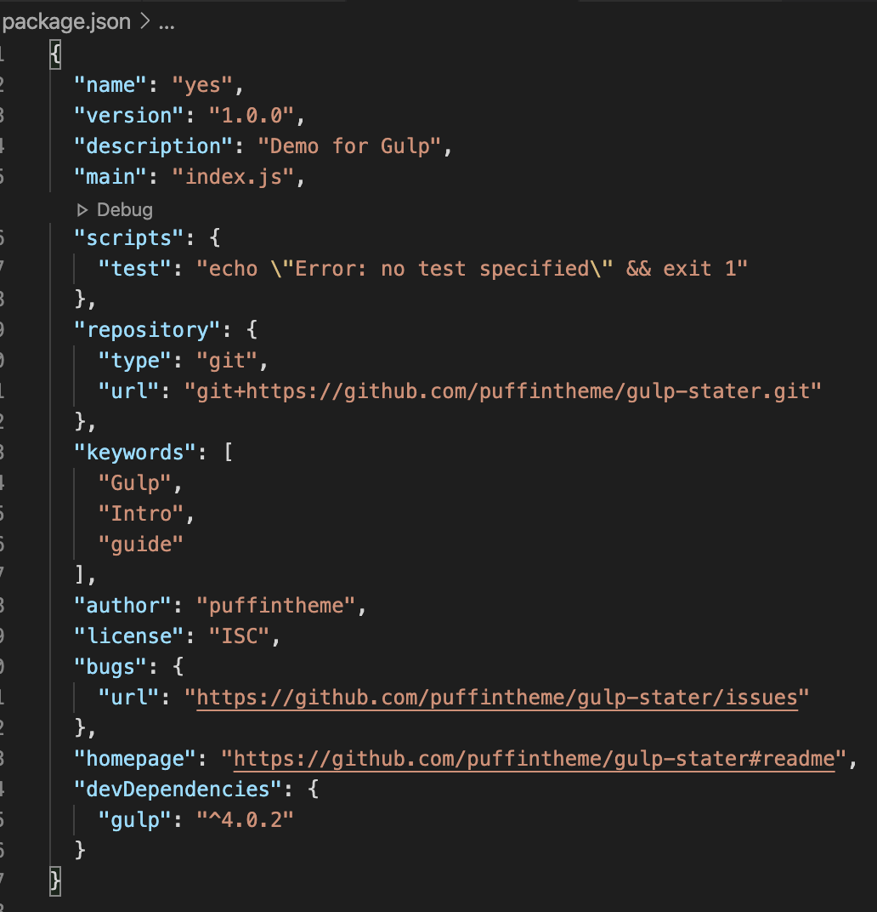

# gulp-stater

<b>Step 1 :</b> Install node “https://nodejs.org/en/download/“

<b>Step 2 :</b> Installing gulp

Windows : <code> $ npm install gulp -g </code>
OR
Mac : <code> $ sudo npm install gulp -g  </code>

Explanation :
NPM : Node Pacakage Manager 
npm install gulp: will install gulp 
-g : It is used to install package globally in your system
sudo : It is only used in Mac system as they need permission to install package globally.

<b>Step 3 :</b> Select Project where you want to integrate Gulp or Create new one with HTML SCSS JS files.

<b>Step 4:</b> Run <code> $ npm init </code> 

It is used to make package.json file.

<b>Step 5 :</b> Run <code> $ npm install gulp --save-dev </code>

install Gulp into the project. When done you can check package.json file there will be gulp in the end with it’s version.

And also gulp will be added to node_module folder.

<b>Step 6 :</b> Folder structure  for <code>gulpfile.js<code>

<code>
|- dist/
	|- assets/
		|- css/
			|- style.min.css
		|- images/
		|- js/
			|- index.js
	|- index.html
|- scss/
	|- style.scss
|- node_module
|- gulpfile.js
|- package.json
|- Readme.md
</code>

<b>Step 7 : </b> Defin variable for Gulp to run

<code> var gulp = require('gulp'); </code>

<b>Step 8 : </b> gulp npm file for converting scss to css

<code> $ npm install gulp-sass --save-dev </code>

Syntex :
<code>
gulp.task('sass', function(){
  return gulp.src('source-files')
    .pipe(sass()) // Using gulp-sass
    .pipe(gulp.dest('destination'))
});
</code>

Or if you want to convert multipal scss file to css then

Syntex :
<code>
gulp.task('sass', function() {
  return gulp.src('scss/**/*.scss') // Gets all files ending with .scss in app/scss and children dirs
    .pipe(sass())
    .pipe(gulp.dest('dist/assets/css/'))
})
</code>

<b> Step 9: </b> watching for change 

Syntex :
<code> gulp.watch('files-to-watch', gulp.series(['tasks', 'to', 'run'])); </code>

<b> Step 10: </b> Browser Sync 

<code> $ npm install browser-sync --save-dev </code>

Run <code>npm install</code> for live demo.
